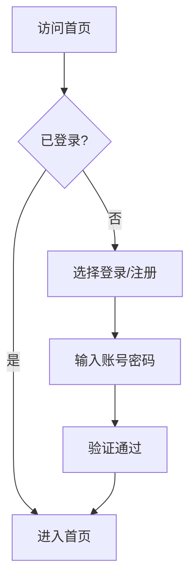
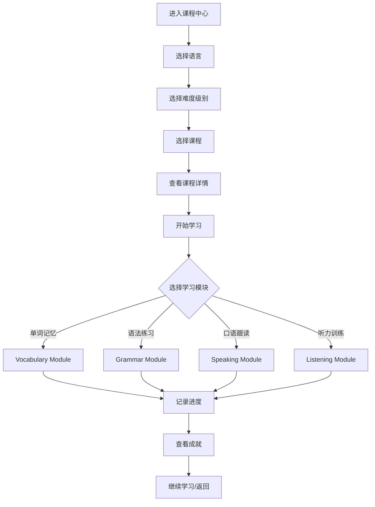
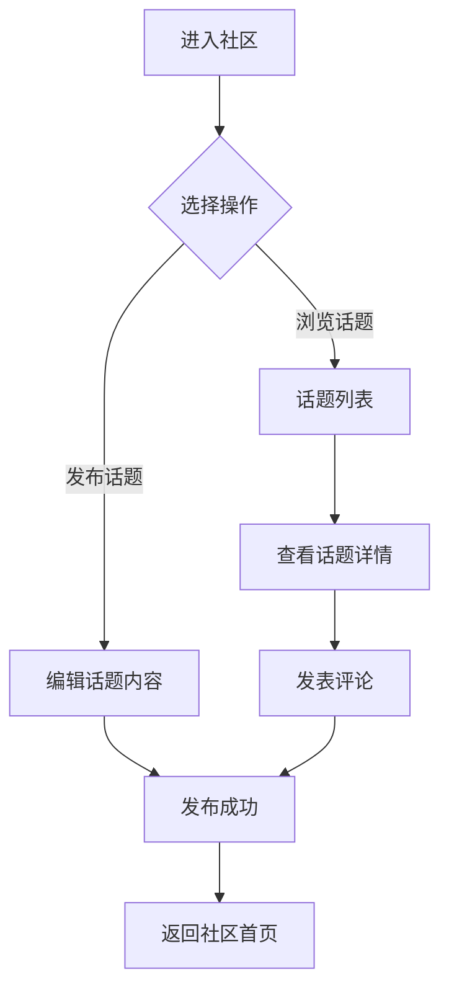

## 1. Product Overview
多语种在线教育平台，为用户提供沉浸式语言学习体验，涵盖英语、日语、韩语等主流语言学习。
- 核心目标：打造专业的语言学习平台，帮助用户高效学习外语
- 目标用户：学生、职场人士、语言爱好者等有语言学习需求的人群

## 2. Core Features

### 2.1 User Roles
| Role | Registration Method | Core Permissions |
|------|---------------------|------------------|
| Normal User | Email/Phone registration | Access all learning features, community, achievements |
| Admin | Invitation only | Manage courses, users, system settings |

### 2.2 Feature Modules
1. **首页**: 课程推荐、学习进度概览、成就展示
2. **课程中心**: 分级课程体系、课程搜索筛选
3. **学习模块**: 单词记忆、语法练习、口语跟读、听力训练
4. **学习进度**: 进度追踪、学习统计、学习报告
5. **个人中心**: 用户信息、学习计划、成就系统
6. **社区**: 学习交流、话题讨论、学习小组

### 2.3 Page Details
| Page Name | Module Name | Feature description |
|-----------|-------------|---------------------|
| 首页 | Hero Section | 平台介绍、热门课程推荐 |
| 首页 | Progress Overview | 当前学习进度、今日学习目标 |
| 首页 | Achievement Display | 最近获得的成就徽章 |
| 课程中心 | Course List | 分级课程列表，支持按语言、难度筛选 |
| 课程中心 | Course Detail | 课程详情、章节列表、开始学习入口 |
| 学习模块 | Vocabulary | 单词卡片记忆、拼写练习 |
| 学习模块 | Grammar | 语法知识点讲解、选择题练习 |
| 学习模块 | Speaking | 口语跟读、语音识别评分 |
| 学习模块 | Listening | 听力材料播放、填空题练习 |
| 学习进度 | Progress Tracking | 各课程学习进度、学习时长统计 |
| 学习进度 | Learning Report | 周/月学习报告、数据分析 |
| 个人中心 | User Profile | 用户基本信息、头像设置 |
| 个人中心 | Study Plan | 个性化学习路径推荐、学习计划制定 |
| 个人中心 | Achievements | 成就徽章展示、获取条件说明 |
| 社区 | Discussion | 话题列表、发帖评论功能 |
| 社区 | Study Group | 学习小组创建、加入、讨论 |

## 3. Core Process

### 3.1 User Registration & Login

### 3.2 Learning Flow

### 3.3 Community Interaction

## 4. User Interface Design

### 4.1 Design Style
- **主色调**: 渐变蓝紫色系 (#667eea 到 #764ba2)，传达专业、现代、学习氛围
- **辅助色**: 绿色 (#10b981) 表示成功/完成，橙色 (#f59e0b) 表示提醒/注意
- **按钮风格**: 圆角矩形，hover时有轻微缩放和阴影效果
- **字体**: 标题使用 'Inter' 粗体，正文使用 'Inter' 常规
- **布局**: 卡片式设计，清晰的信息层级
- **图标**: 使用 Lucide 图标库，风格简洁现代

### 4.2 Page Design Overview
| Page Name | Module Name | UI Elements |
|-----------|-------------|-------------|
| 首页 | Hero Section | 大标题、渐变背景、CTA按钮 |
| 首页 | Progress | 圆形进度条、数字统计、快捷入口 |
| 课程中心 | Course Card | 课程封面图、标题、难度标签、进度指示器 |
| 学习模块 | Vocabulary | 单词卡片、翻转动画、发音按钮 |
| 学习模块 | Speaking | 音频波形、麦克风按钮、评分显示 |
| 个人中心 | Achievement | 徽章网格、解锁动画、成就详情弹窗 |

### 4.3 Responsiveness
- 桌面优先设计，支持响应式布局
- 移动端：简化导航，使用底部标签栏
- 触控优化：按钮尺寸≥44px，间距充足

### 4.4 Accessibility
- 支持键盘导航
- 颜色对比度符合 WCAG 标准
- 图标配有文字说明
- 支持屏幕阅读器