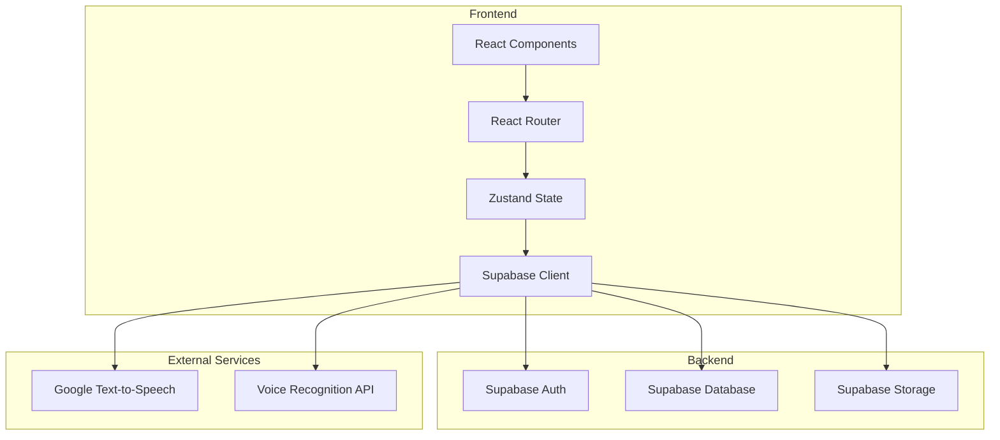
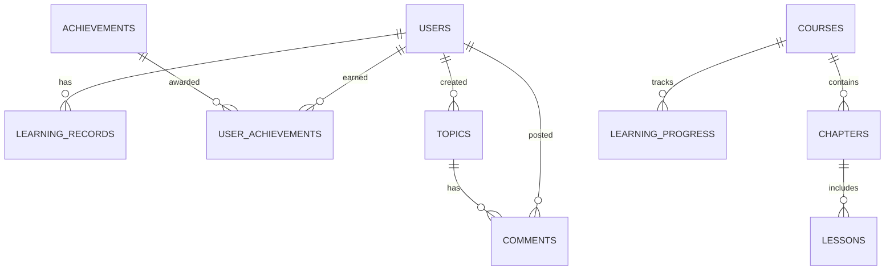

## 1. Architecture Design

## 2. Technology Description
- Frontend: React@18 + TypeScript + TailwindCSS@3 + Vite
- State Management: Zustand
- Routing: React Router DOM
- Backend: Supabase (Auth, Database, Storage)
- Icons: Lucide React
- Charts: Recharts

## 3. Route Definitions
| Route | Purpose |
|-------|---------|
| / | 首页 |
| /courses | 课程中心 |
| /courses/:id | 课程详情页 |
| /learn/:courseId/:module | 学习模块 |
| /progress | 学习进度 |
| /profile | 个人中心 |
| /community | 社区 |
| /community/:topicId | 话题详情 |
| /achievements | 成就系统 |
| /login | 登录页 |
| /register | 注册页 |

## 4. API Definitions

### 4.1 Auth API
| Endpoint | Method | Purpose |
|----------|--------|---------|
| /auth/signup | POST | 用户注册 |
| /auth/signin | POST | 用户登录 |
| /auth/signout | POST | 用户登出 |
| /auth/user | GET | 获取当前用户 |

### 4.2 Course API
| Endpoint | Method | Purpose |
|----------|--------|---------|
| /courses | GET | 获取课程列表 |
| /courses/:id | GET | 获取课程详情 |
| /courses/:id/chapters | GET | 获取课程章节 |

### 4.3 Learning API
| Endpoint | Method | Purpose |
|----------|--------|---------|
| /learning/progress | GET | 获取学习进度 |
| /learning/progress | POST | 更新学习进度 |
| /learning/records | GET | 获取学习记录 |
| /learning/records | POST | 创建学习记录 |

### 4.4 Community API
| Endpoint | Method | Purpose |
|----------|--------|---------|
| /community/topics | GET | 获取话题列表 |
| /community/topics | POST | 创建话题 |
| /community/topics/:id | GET | 获取话题详情 |
| /community/topics/:id/comments | GET | 获取评论列表 |
| /community/topics/:id/comments | POST | 创建评论 |

### 4.5 Achievement API
| Endpoint | Method | Purpose |
|----------|--------|---------|
| /achievements | GET | 获取成就列表 |
| /achievements/user | GET | 获取用户成就 |
| /achievements/user | POST | 解锁成就 |

## 5. Data Model

### 5.1 ER Diagram

### 5.2 Table Definitions

#### users (Supabase Auth)
| Column | Type | Description |
|--------|------|-------------|
| id | uuid | 用户ID |
| email | text | 邮箱 |
| phone | text | 手机号 |
| name | text | 用户名 |
| avatar_url | text | 头像URL |
| created_at | timestamp | 创建时间 |

#### courses
| Column | Type | Description |
|--------|------|-------------|
| id | uuid | 课程ID |
| name | text | 课程名称 |
| language | text | 语言类型 (english/japanese/korean) |
| level | text | 难度级别 (beginner/intermediate/advanced) |
| description | text | 课程描述 |
| cover_image | text | 封面图URL |
| total_chapters | int | 章节总数 |
| created_at | timestamp | 创建时间 |

#### chapters
| Column | Type | Description |
|--------|------|-------------|
| id | uuid | 章节ID |
| course_id | uuid | 所属课程ID |
| name | text | 章节名称 |
| order | int | 排序序号 |
| description | text | 章节描述 |

#### lessons
| Column | Type | Description |
|--------|------|-------------|
| id | uuid | 课时ID |
| chapter_id | uuid | 所属章节ID |
| name | text | 课时名称 |
| type | text | 类型 (vocabulary/grammar/speaking/listening) |
| content | jsonb | 课时内容 |
| order | int | 排序序号 |

#### learning_progress
| Column | Type | Description |
|--------|------|-------------|
| id | uuid | 进度ID |
| user_id | uuid | 用户ID |
| course_id | uuid | 课程ID |
| chapter_id | uuid | 章节ID |
| lesson_id | uuid | 课时ID |
| progress | float | 完成进度 (0-1) |
| completed_at | timestamp | 完成时间 |
| updated_at | timestamp | 更新时间 |

#### learning_records
| Column | Type | Description |
|--------|------|-------------|
| id | uuid | 记录ID |
| user_id | uuid | 用户ID |
| course_id | uuid | 课程ID |
| lesson_id | uuid | 课时ID |
| duration | int | 学习时长(秒) |
| score | float | 得分 |
| created_at | timestamp | 创建时间 |

#### achievements
| Column | Type | Description |
|--------|------|-------------|
| id | uuid | 成就ID |
| name | text | 成就名称 |
| description | text | 成就描述 |
| icon | text | 图标名称 |
| type | text | 类型 (learning/daily/streak/community) |
| condition | jsonb | 解锁条件 |
| points | int | 积分奖励 |

#### user_achievements
| Column | Type | Description |
|--------|------|-------------|
| id | uuid | 记录ID |
| user_id | uuid | 用户ID |
| achievement_id | uuid | 成就ID |
| unlocked_at | timestamp | 解锁时间 |

#### topics
| Column | Type | Description |
|--------|------|-------------|
| id | uuid | 话题ID |
| user_id | uuid | 创建者ID |
| title | text | 话题标题 |
| content | text | 话题内容 |
| category | text | 分类 |
| created_at | timestamp | 创建时间 |
| updated_at | timestamp | 更新时间 |

#### comments
| Column | Type | Description |
|--------|------|-------------|
| id | uuid | 评论ID |
| topic_id | uuid | 话题ID |
| user_id | uuid | 用户ID |
| content | text | 评论内容 |
| created_at | timestamp | 创建时间 |

## 6. Security Considerations
- 使用 Supabase Auth 进行身份验证
- 数据库启用 RLS (Row Level Security)
- API 请求需携带 JWT Token
- 敏感数据加密存储
- 防止 SQL 注入和 XSS 攻击